# Настройка источников данных для NiFi и работа с ними
## Источники данных
1. Открываем сайт Nifi https://localhost:8443/nifi/
 логин: flexberryuser 
 пароль: jhvjhvjhvjhv

2. Открываем конфигурацию группы потоков
 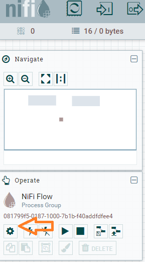

3. Добавляем источник данных
 Вкладка **Controller Services**, конопка **Create** справа над списком
 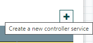

4. Выбираем тип источника данных
 Нас интересует тип **DBCPConnectionPool 1.20.0**
 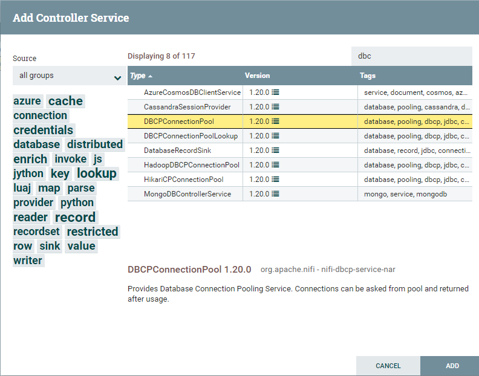

5. Редактируем источник данных
 В списке появится наш источник данных, для редактирования нажимаем кноку **configure** (мальенькая шестеренка)
 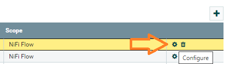

6. Задаем параметры для нашего соединения
 Вкладка **Settings**, атрибут **Name** = DBCPConnectionPoolPostgreSQL
 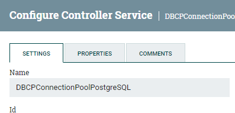
 Вкладка **Properties**
 Атрибут **Database Connection URL** = jdbc:postgresql://app-postgre-db:5432/appdb (имя_сервера:порт/имя_бд)
 Атрибут **Database Driver Class Name** = org.postgresql.Driver
 Атрибут **Database Driver Location(s)** = /opt/jdbc/postgresql-42.5.4.jar (этот пакет т.к. он используется в [докере](https://github.com/Flexberry/Flexberry.NiFiSample/blob/ac70635e8c4cc7626efa6fe3f48e6e90bb646020/src/Docker/Dockerfile.NiFi#L9))
 Атрибут **Database User** = flexberryuser
 Атрибут **Database Password** = jhv ([Параметры БД](https://github.com/Flexberry/Flexberry.NiFiSample/blob/ac70635e8c4cc7626efa6fe3f48e6e90bb646020/src/Docker/SQL/Dockerfile.PostgreSql#L4))
 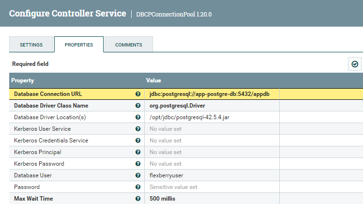
 Применяем изменения, кнопка **Apply**

7. Включаем источник данных
 Кнопка в виде молнии **Enable**
 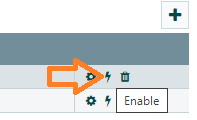

После этого источником данных можно пользоваться.

Чтобы снова отредактировать источник данных, нужно его сначала выключить, кнопка **Disable**, а затем нажать на кнопку **Configure**.

8. Задаем параметры для ClickHouse
 Вкладка **Settings**, атрибут **Name** = DBCPConnectionPoolClickHouse
 Вкладка **Properties**
 Атрибут **Database Connection URL** = jdbc:clickhouse://clickhouse-db:8123/default (имя_сервера:порт/имя_бд)
 Атрибут **Database Driver Class Name** = com.clickhouse.jdbc.ClickHouseDriver
 Атрибут **Database Driver Location(s)** = /opt/jdbc/clickhouse-jdbc-0.4.1-shaded.jar (этот пакет т.к. он используется в [докере](https://github.com/Flexberry/Flexberry.NiFiSample/blob/ac70635e8c4cc7626efa6fe3f48e6e90bb646020/src/Docker/Dockerfile.NiFi#L9))
 Атрибут **Database User** = default
 Атрибут **Database Password** = P@ssw0rd ([Параметры БД](https://github.com/Flexberry/Flexberry.NiFiSample/blob/ac70635e8c4cc7626efa6fe3f48e6e90bb646020/src/Docker/SQL/Dockerfile.ClickHouse#L8))
 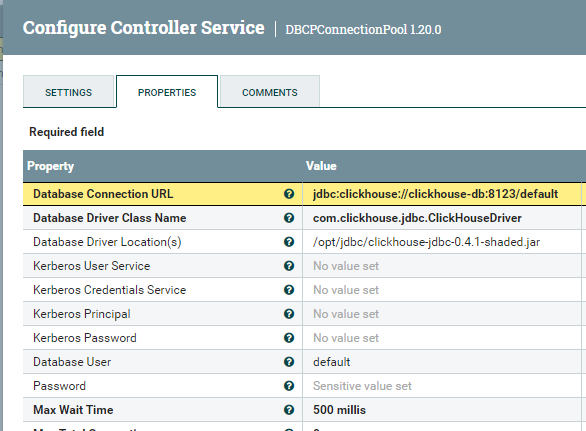
 Применяем изменения, кнопка **Apply**

## Пример использования
Для примера вызовем формирование списка всех имен таблиц в базе данных
1. Создаем процессор
 В главном окне на панели инструментов нажимаем на **Processor** и перетаскиваем его в рабочую область
 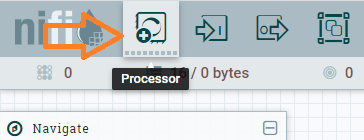
 Выбираем тип **ListDatabaseTables 1.20.0**

2. Редактируем процессор
 Вкладка **Settings**, атрибут **Name** = ListDatabaseTablesPostgreSQL
 Вкладка **Properties**, атрибут **Database Connection Pooling Service** = DBCPConnectionPoolPostgreSQL (выбрать из списка)
 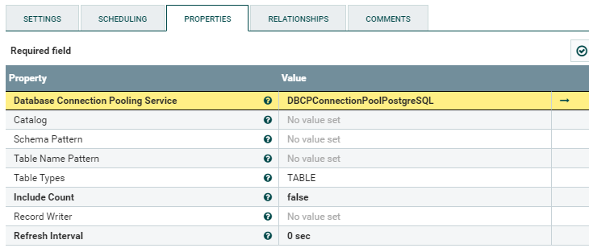
 Применяем изменения, кнопка **Apply**

3. Аналогично с п.2 добавляем процессор для ClickHouse
 Вкладка **Settings**, атрибут **Name** = ListDatabaseTablesClickHouse
 Вкладка **Properties**, атрибут **Database Connection Pooling Service** = DBCPConnectionPoolClickHouse (выбрать из списка)

4. Добавляем объект Funnel
 В главном окне на панели инструментов нажимаем на **Funnel** и перетаскиваем его в рабочую область
 
 Соединяем наши процессоры с Funnel. Наводим указателем на центр процессора в рабочей области, появится стрелка, 
 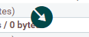
 перетаскиваем ее на объект Funnel, пока линия соединения не станет зеленого цвета.

5. Примерная схема, которая должна получится
 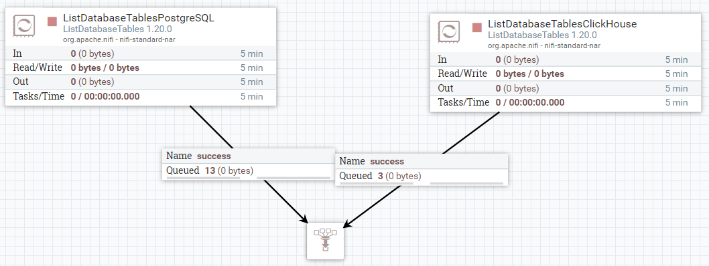

Можно дергать каждый процесс отдельно. Для этого нажимаем правой кнопкой мыши на процессор и выбираем пункт **Run once**.